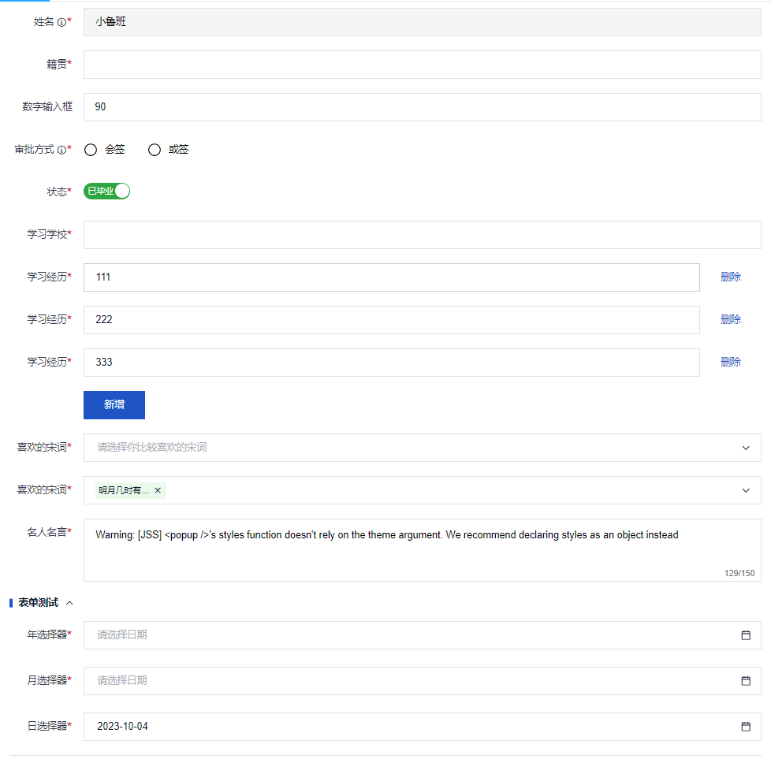
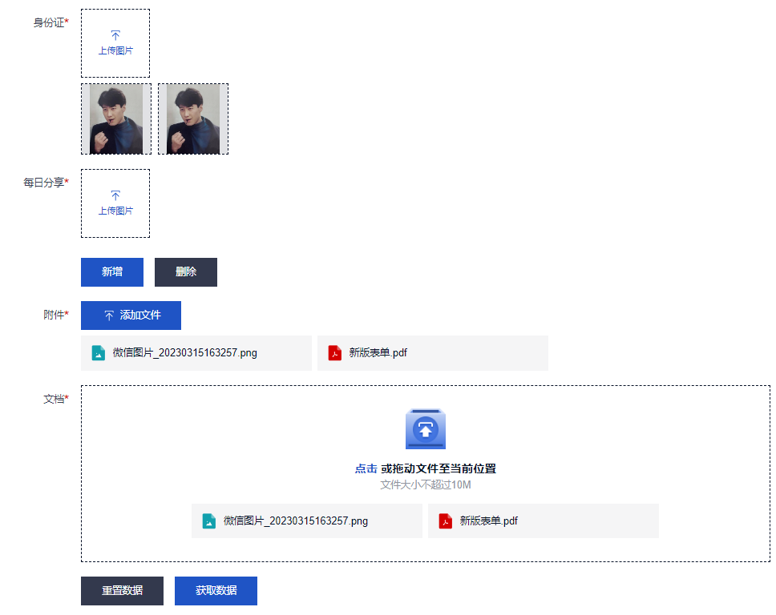
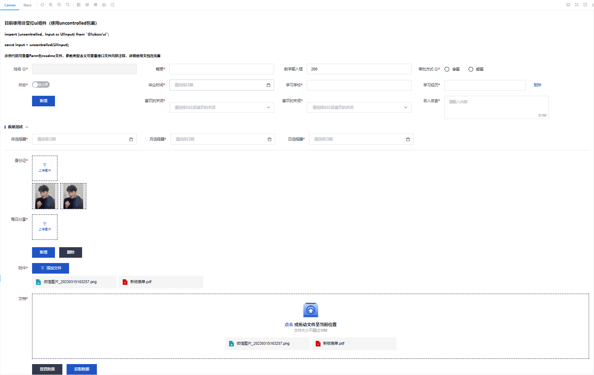

# Form组件使用文档





## 组成部分

* Form          表单容器组件
* FormItem      表单元素容器组件
* FormGroup     表单组组件
* FormLine      表单分割线
* FormList      表单列表

### Form

#### API

| 参数 | 说明 | 类型 | 默认值 |
| ---- |----|----|----|
| defaultValue | 初始默认值 | object | - |
| switchForm | 表单元素显隐联动 | SwitchItem[] | - |
| size | 可设置尺寸的表单元素的尺寸 | "large"、"middle"、"small" | "middle" |
| displayLabel | 表单元素区域宽度 | boolean | true |
| disabled | 禁用组件 | boolean | false |
| labelPosition | 组件label和表单元素之间的布局 | "row"、"column" | "row" |
| onFinish | 提交成功获取的数据回调 | (value: Record<string, unknown>) => void | - |
| onError | 提交失败获取的数据和错误信息 | (data: ErrorReturn) => void | - |

#### FormRefAPI

| 参数 | 说明 | 类型 |
| ---- |----|----|
| submit | 表单提交 | () => void |
| setFormValue | 设置表单元素值 | (value: Record<string, unknown>) => void |
| getFormValue | 获取表单元素值 | (nameList?: string[]) => Record<string, unknown> |
| validate | 获取表单元素值 | (nameList?: string[]) => {ruleResult: Record<string, string | undefined>, errorCount: number} |
| resetForm | 重置表单 | (nameList?: string[]) => void |
| formListAdd | FormList新增 | (name: string, params?: {label?: string; value?: unknown; index?: number;}) => void |
| formListRemove | FormList删除 | (name: string, index?: number) => void |

#### SwitchItem

| 参数 | 说明 | 类型 |
| ---- |----|----|
| name | 监听表单元素名称 | string |
| visibleRule | 校验规则回调 | (value: unknown) => ({hide?: string[]; show?: string[]}) |

### FormItem

#### API

| 参数 | 说明 | 类型 | 默认值 |
| ---- |----|----|----|
| name | 表单元素名称 | string | - |
| label | 表单元素label | string | - |
| info | 表单元素说明 | string | - |
| defaultValue | 表单元素默认值 | unknow | - |
| hidden | 是否隐藏该表单元素 | boolean | false |
| required | 是否必填 不传入时使用rules决定 | boolean | false |
| rules | 校验规则 | Rule[] | - |
| validateTrigger | 规则校验时机（目前onBlur还不支持，因为luban表单元素还没有该事件） | "onChange"、"onBlur" | "onChange" |
| showUploadResults | 是否显示上传Result组件，仅按钮上传和图片上传有效 | boolean | true |
| uploadResult | 上传Result组件配置参数, 仅按钮上传和图片上传有效 resultMaxHeight:上传内容区最大高度（滚动展示），默认240 | Omit<ResultProps 或 UploadResultLBProps, "initialFile"> & {resultMaxHeight?: number} | - |

#### RuleAPI
| 参数 | 说明 | 类型 | 默认值 |
| ---- |----|----|----|
| Rule | 规则校验 type===custom为自定义校验规则，返回true表示通过校验，false表示报错信息为自动的，字符串表示需要显示的报错信息 | (Validator & {message?: string}) 或 {type: "required", message?: string} 或 {type: "custom", validator: (val: unknown) => boolean 或 string} | - |

### FormGroup

#### API

| 参数 | 说明 | 类型 | 默认值 |
| ---- |----|----|----|
| name | 表单组名称 | string | - |
| label | 表单组label | string | - |
| showFold | 是否显示折叠功能,有label的时候有效 | boolean | false |

### FormLine
| 参数 | 说明 | 类型 | 默认值 |
| ---- |----|----|----|
| - | - | - | - |

### FormList

#### API

| 参数 | 说明 | 类型 | 默认值 |
| ---- |----|----|----|
| name | FormList名称 | string | - |

### Validator
使用@luban/validator库，使用样例大致罗列：

```typescript
number:
    rules=["number"]
    rules=[{type: "number"}]
    rules=[{type: "number", min: 0, max: 100}]
    rules=[{type: "number", range: [-10, 500], message: "请输入范围内的数据"}]
    rules=[{type: "number", integer: ture}]
    rules=[{type: "number", positive: ture}]

text:
    rules=["text"]
    rules=[{type: "text", minLength: 2}]
    rules=[{type: "text", maxLength: 5}]
    rules=[{type: "text", length: [2, 5]}]
    rules=[{type: "text", regex: "a"}]
    rules=[{type: "text", singleLine: true}]
    rules=[{type: "text", include: "a"}]
    rules=[{type: "text", caseSensitity: true}]

integer:
    rules=["integer"]
    rules=[{type: "integer"}]

positive:
    rules=["positive"]
    rules=["notPositive"]

negative:
    rules=["negative"]
    rules=["notNegative"]

boolean:
    rules=["boolean"]
    rules=[{type: "boolean"}]

array:
    rules=["array"]
    rules=[{type: "array"}]
    rules=[{type: "array", length: [2, 6]}]
    rules=[{type: "array", minLength: 2}]
    rules=[{type: "array", maxLength: 6}]
    rules=[{type: "array", every: {type: "number"}}]
    rules=[{type: "array", some: {type: "number"}}]
    rules=[{type: "array", unique: true}]
    rules=[{type: "array", unique: [1, 2]}]

unique:
    rules=["unique"]
    rules=[{type: "unique"}]

empty:
    rules=["empty"]
    rules=[{type: "empty"}]
    rules=["notEmpty"]
    rules=[{type: "notEmpty"}]

any:
    rules=["any"]
    rules=[{type: "any"}]

object:
    rules=["object"]
    rules=[{type: "object", paths: {'a': {type: "array"}}}]
    rules=[{type: "object", keys: ["a", "b"]}]

options:
    rules=[{type: "options", options: [null, 1, true, undefined]}]

not:
    rules=[{type: "not", validator: {type: "number"}}]
```

### 使用文档代码示例(/main/*)

```typescript

import React, {useRef, useCallback} from "react";
import type {ComponentStory} from "@storybook/react";
import {uncontrolled, UploadImage, UploadButton, UploadDrag, DatePicker as UIDatePicker, Radio as UIRadio, Select as UISelect, Input as UIInput, InputNumber as UIInputNumber, Switch as UISwitch, MultipleSelect as UIMultipleSelect, TextArea as UITextArea, Button} from "@luban/ui";
import type {FormRefType} from "@luban/ui";
import FormListItem from "./FormListItem";
import Form from "./Form";
import FormItem from "./FormItem";
import FormGroup from "./FormGroup";
import FormLine from "./FormLine";
import FormList from "./FormList";
import {FakeHandler, initialFile} from "../upload/fakeHandler";

const Input = uncontrolled(UIInput);
const InputNumber = uncontrolled(UIInputNumber);
const Switch = uncontrolled(UISwitch);
const TextArea = uncontrolled(UITextArea);
const MultipleSelect = uncontrolled(UIMultipleSelect);
const Select = uncontrolled(UISelect);
const DatePicker = uncontrolled(UIDatePicker);
const Radio = uncontrolled(UIRadio);

export default {
    title: "数据录入/Form 表单",
    component: Form,
};

const selectOptions = [
    {title: "明月几时有，把酒问青天。", value: "value1", backgroundColor: "#EBFAED", info: "水调歌头·明月几时有"},
    {title: "人有悲欢离合，月有阴晴圆缺，此事古难全。", value: "value2", backgroundColor: "#E6F2FE", info: "水调歌头·明月几时有"},
    {title: "十年生死两茫茫，不思量，自难忘。", value: "value3", disabled: true, info: "江城子·乙卯正月二十日夜记梦"},
    {title: "相顾无言，惟有泪千行。", backgroundColor: "#EBFAED"},
    {title: "怒发冲冠，凭栏处、潇潇雨歇。", backgroundColor: "#EBFAED"},
    {title: "大江东去，浪淘尽、千古风流人物。", info: "一个超长的描述信息，需要一些占位"},
    {title: "江山如画，一时多少豪杰。", value: "value6", info: "description"},
    {title: "寻寻觅觅，冷冷清清，凄凄惨惨戚戚。", value: "value7", info: "description"},
    {title: "满地黄花堆积，憔悴损，如今有谁堪摘？", backgroundColor: "#EBFAED"},
    {title: "梧桐更兼细雨，到黄昏、点点滴滴。"}
];

const Template: ComponentStory<typeof Form> = (args) => {
    const formRef = useRef<FormRefType>(null);
    /** 兼容storybook文档 Docs模式下有多个上传组件有相同id的情况 */
    const timeRef = useRef<string>(Date.now().toString());
    const submit = useCallback(() => {
        if (formRef.current !== null) {
            formRef.current.submit();
        }
    }, []);

    const resetForm = useCallback(() => {
        if (formRef.current !== null) {
            formRef.current.resetForm();
        }
    }, []);

    const add = useCallback(() => {
        if (formRef.current !== null) {
            formRef.current.formListAdd(`formList_uploadImage_${timeRef.current}`);
        }
    }, []);

    const remove = useCallback(() => {
        if (formRef.current !== null) {
            formRef.current.formListRemove(`formList_uploadImage_${timeRef.current}`);
        }
    }, []);

    const addStudy = useCallback(() => {
        if (formRef.current !== null) {
            formRef.current.formListAdd("listTest");
        }
    }, []);

    return (
        <>
            <h4>目前使用非受控ui组件（使用uncontrolled包裹）</h4>
            <h5>{"import {uncontrolled,, Input as UIInput} from \"@luban/ui\";"}</h5>
            <h5>const Input = uncontrolled(UIInput);</h5>
            <h5>示例代码可查看Form包readme文件，参数类型含义可查看接口文件内部注释，详细使用文档在完善</h5>
            <Form
                ref={formRef}
                {...args}
            >
                <FormItem name="input" label="姓名" required disabled info="111111">
                    <Input />
                </FormItem>
                <FormItem name="text" label="籍贯" rules={[{type: "required", message: "请填写您的籍贯"}]}>
                    <Input />
                </FormItem>
                <FormItem
                    name="inputNumber"
                    label="数字输入框"
                    defaultValue={200}
                    rules={[
                        {type: "number", max: 100, message: "不能大于100"},
                        {type: "number", min: 0, message: "不能小于0"},
                    ]}
                >
                    <InputNumber
                        placeholder="请输入年龄"
                    />
                </FormItem>
                <FormItem
                    name="multipleType"
                    label="审批方式"
                    required
                    info="或签：任一审批人提交，流程即流转到下一节点。会签：所有审批人提交，流程才流转到下一节点"
                >
                    <Radio options={[
                        {
                            title: "会签",
                            value: 1
                        },
                        {
                            title: "或签",
                            value: 2
                        }
                    ]}
                    />
                </FormItem>
                <FormItem name="switch" label="状态" required>
                    <Switch content={["已毕业", "在上学"]} />
                </FormItem>
                <FormItem name="time" label="毕业时间" required>
                    <DatePicker />
                </FormItem>
                <FormItem name="school" label="现在学习学校" required>
                    <Input />
                </FormItem>
                <FormList name="listTest">
                    <FormItem label="学习经历" required>
                        <FormListItem formRef={formRef} listName="listTest" />
                    </FormItem>
                </FormList>
                <FormItem>
                    <Button text="新增" onClick={addStudy} />
                </FormItem>
                <FormItem name="select1" label="你喜欢的宋词" required>
                    <Select
                        options={selectOptions}
                        placeholder="请选择你比较喜欢的宋词"
                        search
                        infoPosition="bottom"
                    />
                </FormItem>
                <FormItem name="select" label="你喜欢的宋词" required>
                    <MultipleSelect
                        options={selectOptions}
                        placeholder="请选择你比较喜欢的宋词"
                        search
                        infoPosition="bottom"
                    />
                </FormItem>
                <FormItem name="area" label="名人名言" required rules={[{type: "text", maxLength: 150, message: "最大输入150字"}]}>
                    <TextArea maxLength={150} />
                </FormItem>
                <FormGroup name="formGroup" label="表单测试" showFold>
                    <FormItem name="year" required label="年选择器">
                        <DatePicker mode="year" />
                    </FormItem>
                    <FormItem name="month" required label="月选择器">
                        <DatePicker mode="month" />
                    </FormItem>
                    <FormItem name="day" required label="日选择器">
                        <DatePicker />
                    </FormItem>
                </FormGroup>
                <FormLine />
                <FormItem
                    name={`uploadImage_${timeRef.current}`}
                    wrapperWidth="100%"
                    label="身份证"
                    required
                    defaultValue={initialFile.map((v) => ({...v, src: "https://img2.baidu.com/it/u=366174550,2416382650&fm=253&fmt=auto&app=138&f=JPEG?w=500&h=650"}))}
                    uploadResult={{
                        image: true,
                        // eslint-disable-next-line no-console
                        onRemoveFile: (id, i) => console.log("remove id", id, i)
                    }}
                >
                    <UploadImage
                        multiple
                        fileTypes={["png", "jpeg"]}
                        Handler={FakeHandler}
                        config={{current: {}}}
                    />
                </FormItem>
                <FormList name={`formList_uploadImage_${timeRef.current}`}>
                    <FormItem
                        wrapperWidth="100%"
                        label="每日分享"
                        required
                        uploadResult={{
                            image: true,
                            // eslint-disable-next-line no-console
                            onRemoveFile: (id, i) => console.log("remove id", id, i)
                        }}
                    >
                        <UploadImage
                            multiple
                            fileTypes={["png", "jpeg"]}
                            Handler={FakeHandler}
                            config={{current: {}}}
                        />
                    </FormItem>
                </FormList>
                <FormItem>
                    <Button text="新增" onClick={add} />
                    <Button text="删除" onClick={remove} type="secondary" />
                </FormItem>
                <FormItem
                    name={`uploadButton_${timeRef.current}`}
                    wrapperWidth="100%"
                    label="附件"
                    required
                    defaultValue={initialFile}
                    uploadResult={{
                        resultMaxHeight: 240,
                        // eslint-disable-next-line no-console
                        onRemoveFile: (id, i) => console.log("remove id", id, i)
                    }}
                >
                    <UploadButton
                        multiple
                        fileTypes={["png", "jpeg"]}
                        Handler={FakeHandler}
                        config={{current: {}}}
                    />
                </FormItem>
                <FormItem name={`uploadDrag_${timeRef.current}`} wrapperWidth="100%" label="文档" required defaultValue={initialFile}>
                    <UploadDrag
                        multiple
                        fileTypes={["png", "jpeg"]}
                        Handler={FakeHandler}
                        config={{current: {}}}
                    />
                </FormItem>
                <FormItem>
                    <Button text="重置数据" type="secondary" onClick={resetForm} />
                    <Button text="获取数据" onClick={submit} />
                </FormItem>
            </Form>
        </>
    );
};

export const Default = Template.bind({});
Default.args = {
    switchForm: [
        {
            name: "switch",
            visibleRule: (value) => {
                if (value !== false) {
                    return {
                        show: ["school", "formGroup.day"],
                        hide: ["time"],
                    };
                }
                return {show: ["time"], hide: ["school", "formGroup.day"]};
            }
        }
    ],
    defaultValue: {
        switch: true,
        input: "小鲁班",
        inputNumber: 90,
        switchInput: "222",
        area: "Warning: [JSS] <popup />'s styles function doesn't rely on the theme argument. We recommend declaring styles as an object instead",
        select: ["value1"],
        formGroup: {day: 1696348800000},
        listTest: ["111", "222", "333"]
    },
    // eslint-disable-next-line no-console
    onError: (val) => console.log(val),
    // eslint-disable-next-line no-console
    onFinish: (val) => console.log(val)
};

export const 行内布局 = Template.bind({});
行内布局.args = {
    wrapperWidth: 500
};


封装表单元素示例：
// FormListItem:
import React, {useImperativeHandle, useCallback, useContext, forwardRef, useRef} from "react";
import {Input as UIInput, uncontrolled, Button, FormRefType, FormListIndexContext, InputRefType} from "@luban/ui";
import {createUseStyles} from "@luban/style";

const useStyle = createUseStyles(() => ({
    container: {
        display: "flex"
    }
}), {name: "FormListItem"});

const Input = uncontrolled(UIInput);
interface FormListItemType {
    defaultValue?: string;
    formRef: React.RefObject<FormRefType>;
    listName: string;
    name?: string;
    onChange?: (data: string) => void
}
interface FormListItemRef {
    value?: string;
    getValue?: () => string;
}
const FormListItem = forwardRef<FormListItemRef, FormListItemType>(({defaultValue, formRef, listName, name, onChange}, ref) => {
    const {getIndex} = useContext(FormListIndexContext);
    const inputRef = useRef<InputRefType>(null);
    const {container} = useStyle();
    const del = useCallback(() => {
        if (formRef.current !== null && name !== undefined) {
            formRef.current.formListRemove(listName, getIndex(name));
        }
    }, [formRef, getIndex, listName, name]);

    useImperativeHandle<FormListItemRef, FormListItemRef>(ref, () => ({
        getValue: () => inputRef.current?.value ?? ""
    }), []);

    return (
        <div className={container}>
            <Input defaultValue={defaultValue} onChange={onChange} ref={inputRef} />
            <Button text="删除" type="ghost" onClick={del} />
        </div>
    );
});


export default FormListItem;

```